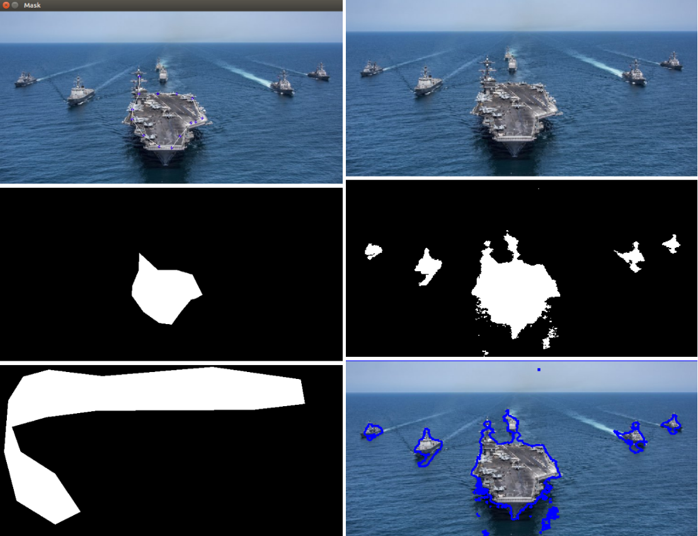

### Python Implementation of "Convex Histogram-Based Joint Image Segmentation with Regularized Optimal Transport Cost"

#### Introduction
In this code implementation, user gives priori information by manually selecting possible segments in input Image. 

<p align="center">
    
</p>

```
1x1 : priori information (Manual Selection)         1x2 : Input Image 
2x1 : Selected Mask 1                               2x2 : Final Segmented mask 
3x1 : Selected Mask 2                               3x2 : Boundary Ovrlay of Mask
```
#### Usage
Put Image to be segmented in Images folder. Code Modules are in Source directory as follows:
```
CreateMask.py   :   Left Mouse Click - Select Area
                    Right Mouse Click - Finish Selecting
                    'Enter' key - Done
utils.py        :   Helper Functions and Classes
main.py         :   Main module
```
###### Commad Line Arguments
First positional argument is image name to be segmented. Rest are optional. Run ```python main.py --help``` for details.

#### Demo
Run following command from main working directory. Results are saved in ```results``` folder.
```
cd Source
python main.py ship.jpg --labels=2 --manual_label 1
```
#### Dependencies
```
* opencv
* scipy
* matplotlib
```
#### Reference

This code is Python implementation of this [paper](https://link.springer.com/article/10.1007/s10851-017-0725-5).

>  Convex Histogram-Based Joint Image Segmentation with Regularized Optimal Transport Cost
> Papadakis, Nicolas and Rabin, Julien
```
@article{papadakis2017convex,
  title={Convex Histogram-Based Joint Image Segmentation with Regularized Optimal Transport Cost},
  author={Papadakis, Nicolas and Rabin, Julien},
  journal={Journal of Mathematical Imaging and Vision},
  volume={59},
  number={2},
  pages={161--186},
  year={2017},
  publisher={Springer}
}
```