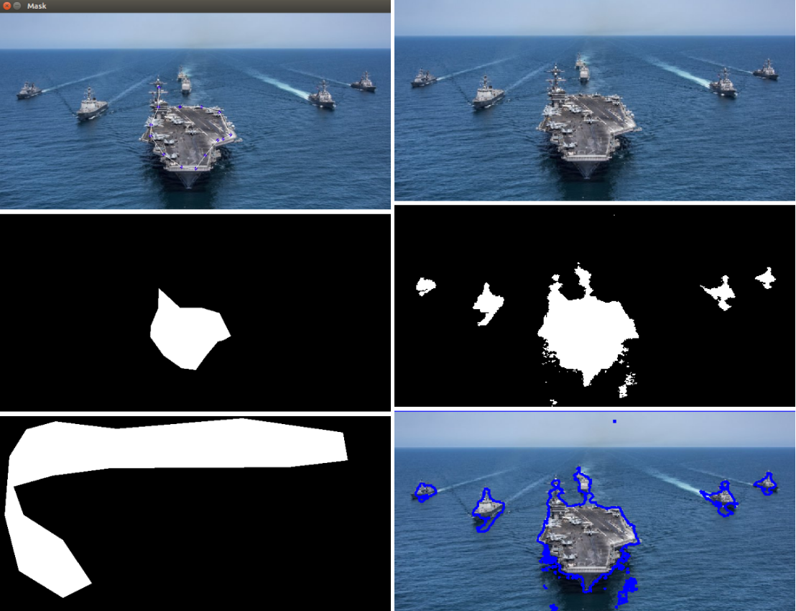

### Python Implementation of "Convex Histogram-Based Joint Image Segmentation with Regularized Optimal Transport Cost"

#### Introduction
This work investigates a versatile convex framework for multiple image segmentation, relying on the regularized optimal mass transport theory.  Global multidimensional histograms are estimated from the segmented image regions and are compared to reference models that are either fixed histograms given a priori, or directly inferred in the non-supervised case. 
In this code implementation, user gives priori information by manually selecting possible segments in input Image.

<p align="center">
    
</p>

```
1x1 : priori information (Manual Selection)         1x2 : Input Image 
2x1 : Selected Mask 1                               2x2 : Final Segmented mask 
3x1 : Selected Mask 2                               3x2 : Boundary Ovrlay of Mask
```
#### Usage
Put Image to be segmented in Images folder. Code Modules are in Source directory as follows:
```
CreateMask.py : GUI to select mask using left click of Mouse. 
```


#### Citation
```
@article{papadakis2017convex,
  title={Convex Histogram-Based Joint Image Segmentation with Regularized Optimal Transport Cost},
  author={Papadakis, Nicolas and Rabin, Julien},
  journal={Journal of Mathematical Imaging and Vision},
  volume={59},
  number={2},
  pages={161--186},
  year={2017},
  publisher={Springer}
}
```